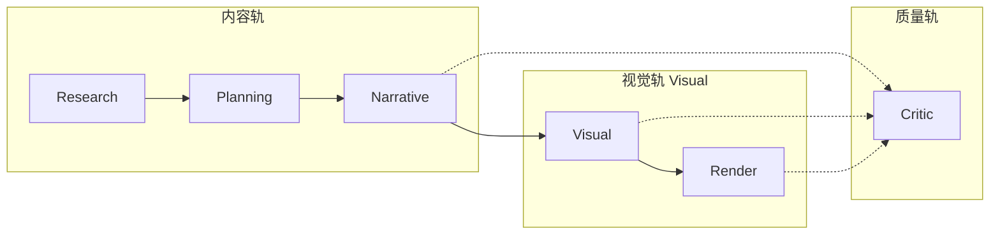

# Pipeline 逻辑角色（Role Logic）

> **设计原则**：借鉴 PPTAgent / DeepPresenter 的**阶段责任与输出契约**，不照搬「很多 Agent」。
> 阿基姆用 **Service + Domain 模型 + Workflow 图** 承载角色；`archium/agents/` 仅保留少量 LLM planner，**不**为每个角色新建长期 Agent 类。

## 产品侧 Agent 数量（硬上限）

**不要继续增加 Agent。** 禁止出现 `ArchitectureAgent2` / `VisualAgent3` / `LayoutAgent4` 一类编号分叉。

产品侧只保持这 **六个** 逻辑席位：

| # | 角色 | 一句话 |
|---|------|--------|
| 1 | **Research** | 事实、资料、来源 |
| 2 | **Planning** | 任务 / 成果 / 工作路径（Mission） |
| 3 | **Narrative** | 大纲、故事线、页级意图 |
| 4 | **Visual** | 视觉意图、构图、版式、图片处理（内部可再拆阶段） |
| 5 | **Render** | 执行已批准场景 → 可打开的文件 |
| 6 | **Critic** | 列出可修复问题，不静默改稿 |

实现可以是 service、workflow node、或单次 LLM 调用，**不必**是 `class XxxAgent`。
能力增长优先落在现有席位的 **Service / Domain 产物**，而不是新开 Agent。

## 为何需要「角色」而不是「Agent 类」

| 外部参考 | 做法 | 阿基姆借鉴点 | 阿基姆避免 |
|----------|------|-------------|-----------|
| **PPTAgent** | `editor` / `coder` / `content organizer` / `layout selector` | 每阶段有清晰输入输出；语义层与几何层分离 | 同名四类 Agent、第二套 PPT 内核 |
| **DeepPresenter** | Planner → Research → PPTAgent/Design → 导出 | 主链阶段可组合、可跳过 | SubAgent 爆炸、运行时 Agent 环境复制 |

**正确抽象**：产品六席位（上表）+ 可选的 **Visual 内部阶段标注**（Architecture / Composition / Layout）——后者只是代码与 E2E 的细粒度标签，**不是**新的 Agent。

## 六席位总览



| 角色 | 一句话职责 | 核心产物（Artifact） | 主要实现形态 |
|------|-----------|---------------------|-------------|
| **Research** | 事实、资料、来源、可引用证据 | `Fact`、资料片段、`PresentationManuscript`、`Citation` | Service + ingestion workflow |
| **Planning** | 任务澄清、工作路径、成果选择 | `Mission`、`PlanningSession`、`DeliverablePlan` | `planning_workflow_service` 等 |
| **Narrative** | 大纲、故事线、章节节奏、页级意图 | `Brief`、`Storyline`、`OutlinePlan`、`SlideSpec` | 少量 `*Planner` + `presentation_service` |
| **Visual** | 专业语义 + deck 节奏 + 单页几何 + 图片管线 + **Vision Engine（概念/图示/氛围生成）** | Schema / `VisualIntent` / `LayoutPlan` / Scene / `ai_generated` Asset | `application/visual/*`（**非**新 Agent） |
| **Render** | 可打开的输出文件与场景实例化 | PPTX / PDF / PNG | PptxGen execute-only、scene compiler |
| **Critic** | 发现**具体问题**（可修复项），非泛泛打分 | `ReviewFinding`、`LayoutIssue`、`VisualCritique` | `application/review/*`（与 Repair 分离授权） |

### Visual 内部阶段（标注用，不是 Agent）

代码与 E2E 仍可能使用细粒度 `PipelineRole`：`architecture` / `composition` / `layout`。它们全部归入产品席位 **Visual**：

| 内部阶段 | 含义 |
|----------|------|
| Architecture | 建筑专业语义、问题—策略—证据关系（schema） |
| Composition | Deck 节奏、页功能、`VisualIntent` |
| Layout | 单页几何、`LayoutPlan` / Scene 结构 |

产品对话与路线图只说 **Visual**，不要再开 `LayoutAgent` / `CompositionAgent`。

## 角色详解与代码映射

### 1. Research Role

**责任**：从项目资料中提取可验证事实与来源，**不**写汇报修辞。

| 类型 | 路径 |
|------|------|
| Workflow | `retrieve_context` → `extract_facts` → `validate_facts`（`archium/workflow/nodes/ingestion.py`） |
| Service | `ingestion_service.py`、`presentation_manuscript_service.py` |
| Agent（LLM 辅助） | `citations.py`、RAG via `agents/_helpers.py` |
| Domain | `presentation_manuscript.py`、`Citation`、`Asset` |
| WorkflowStep | `RETRIEVE_CONTEXT`、`EXTRACT_FACTS`、`VALIDATE_FACTS`、`RESOLVE_CITATIONS`、`MATCH_ASSETS` |

**输出契约**：事实带来源；禁止把参考 PPT 案例文本写入 manuscript 事实层。

---

### 2. Planning Role

**责任**：弄清「做什么、交付什么、走哪条工作路径」，**不**写页文案、**不**排版。

| 类型 | 路径 |
|------|------|
| Workflow | `PlanningWorkflowService`、Mission / Deliverable / Workstream 闸门 |
| Domain | `Mission`、`PlanningSession`、`DeliverablePlan` |
| 文档 | [`docs/project-mission-adaptive-planning.md`](../project-mission-adaptive-planning.md) |

**输出契约**：可批准的任务与成果计划；创建 Presentation 前不假装已有最终稿。

---

### 3. Narrative Role

**责任**：把事实组织为可汇报的叙事结构（章节、关键信息、拆页）。

| 类型 | 路径 |
|------|------|
| Agent | `narrative_architect.py`、`outline_planner.py`、`slide_planner.py`、`brief_builder.py` |
| 场景特化 | `cultural_narrative_planner.py`、`renovation_issue_planner.py`（偏 Visual 边界） |
| Service | `presentation_service.py`、`outline_service.py` |
| Domain | `Brief`、`Storyline`、`OutlinePlan`、`SlideSpec` |
| WorkflowStep | `BRIEF`、`STORYLINE`、`OUTLINE`、`SLIDES` + 各 `REVIEW_*` |

**输出契约**：`SlideSpec` 只含**项目内容**（title / message / key_points / citations），不含参考模板坐标。

---

### 4. Visual Role（含内部 Architecture / Composition / Layout）

**责任**：从专业语义与视觉意图，落到可渲染的版式与图片处理；**不**替代 Narrative 写故事，**不**在本角色内导出最终 PPTX（那是 Render）。

#### 4a. Architecture（内部）

| 类型 | 路径 |
|------|------|
| Schema 契约 | `architectural_content_schema.py` |
| 提取 / 填充 | `architectural_content_schema_extractor.py`、`semantic_content_plan.py` |
| 模板归纳 | `template_induction_service.py`、`reference_slide_matcher.py` |
| Co-plan | `outline_template_co_planning_service.py` |
| 问题—策略 | `renovation_issue_planner.py`、review `architectural.py` |

**输出契约**：语义需求（claim / evidence），**不**绑定参考案例文字。

#### 4b. Composition（内部）

| 类型 | 路径 |
|------|------|
| Service | `deck_composition_service.py`、`art_direction_service.py`、`visual_intent_service.py` |
| WorkflowStep | `VISUAL_GENERATE_DECK_COMPOSITION`、`VISUAL_GENERATE_ART_DIRECTION`、`VISUAL_GENERATE_INTENTS` |

**输出契约**：`DeckCompositionPlan` / `VisualIntent`；**不**含绝对坐标。详见 [`DECK_COMPOSITION_ARCHITECTURE.md`](DECK_COMPOSITION_ARCHITECTURE.md)。

#### 4c. Layout（内部）

| 类型 | 路径 |
|------|------|
| Service | `layout_planning_service.py`、`layout_validation_service.py`、`layout_repair_service.py` |
| 基础设施 | `archium/infrastructure/layout/` |
| WorkflowStep | `VISUAL_GENERATE_LAYOUT_CANDIDATES`、`VISUAL_SELECT_LAYOUTS`、… |

**输出契约**：`LayoutPlan` / Scene 结构节点；项目内容来自 `SlideSpec`。

#### 4d. Vision Engine（战略缺口 → 见专章）

创造概念图 / 分析示意 / 氛围图 / 手绘感插图，经 Prompt Compiler → 可插拔 Image API → Asset（`ai_generated`）→ Studio/Layout。  
**不是** Midjourney 套壳；证据槽默认禁止生成图冒充现场。详见 [`vision-intelligence-layer.md`](vision-intelligence-layer.md)。

---

### 5. Render Role

**责任**：把已批准的计划**执行**为可交付文件；渲染阶段**不重做**叙事或选版式。

| 类型 | 路径 |
|------|------|
| Workflow | `VISUAL_RENDER`（`archium/workflow/visual_nodes.py`） |
| PPTX | `infrastructure/renderers/pptxgen/` + `render-plan.mjs`（execute-only） |
| Scene | `render_scene_compiler.py`、`studio_scene_service.py` |
| Legacy | Marp / JSON export（presentation graph） |

**输出契约**：PPTX/PDF/PNG 可打开；`render-plan.mjs` **禁止**重选版式族（见 [`docs/visual/architecture.md`](../visual/architecture.md)）。

---

### 6. Critic Role

**责任**：列出**可操作的**问题清单；是否阻断导出、是否触发修复由策略决定。

| 类型 | 路径 |
|------|------|
| 四层审核 | `application/review/service.py` |
| 语义 / 场景 | `slide_semantic.py`、`scene_render_qa.py` |
| 视觉只读 | `visual_critic_service.py`、`deck_qa_service.py` |
| 修复（非 Critic） | `slide_repair_service.py`、`layout_repair_service.py`、`deck_repair_service.py` |

**输出契约**：`ReviewFinding`；Critic **不**直接改稿。

---

## 三条并行轨道

| 轨道 | 触发场景 | 角色覆盖 |
|------|---------|---------|
| **Presentation graph** | 默认汇报生成 | Research → Planning（若走 Mission）→ Narrative → Critic → Export |
| **Visual graph** | 可选视觉编排 | Visual（Composition→Layout）→ Render → Critic |
| **Template induction** | 参考 PPTX 归纳 | Visual 内部阶段 → Render |

```
Presentation:  资料 → Brief → Storyline → Outline → SlideSpec → Review → 导出
Visual:        SlideSpec → ArtDirection → VisualIntent → LayoutPlan → PPTX
Induction:     参考PPTX → Schema/Template → Co-plan → ReferenceSlideEditing → RenderScene
```

## Agent 类边界（刻意保持稀少）

`archium/agents/` 当前仅保留**需要 LLM 且边界清晰**的 planner：

| Agent | 主要角色 |
|-------|---------|
| `brief_builder` | Narrative |
| `narrative_architect` | Narrative |
| `outline_planner` | Narrative |
| `slide_planner` | Narrative |
| `cultural_narrative_planner` | Narrative + Visual |
| `renovation_issue_planner` | Visual（专业语义） |
| `citations` | Research |
| `reference_style_profiler` | Visual（风格，非版式） |

**严禁新增**：

- `ResearchAgent` / `PlanningAgent` / `NarrativeAgent` / `VisualAgent` / `RenderAgent` / `CriticAgent`
- 任何编号分叉：`ArchitectureAgent2`、`VisualAgent3`、`LayoutAgent4`、…
- 为 Layout / Composition / Architecture 单独长期 Agent 类

对应能力进 **现有六席位下的 Service / Workflow node**。

## 与 E2E 验收 stage 的对照

| E2E stage | 产品席位 | 内部 PipelineRole（若有） |
|-----------|---------|---------------------------|
| `ingest` / `research` | Research | research |
| Mission / deliverable 规划 | Planning | planning |
| `outline_confirmation` / `slides` | Narrative | narrative |
| `deck_composition` | Visual | composition |
| `layout` | Visual | layout |
| `pptx_export` / `studio_edit` | Render | render |
| `human_review` / `final_acceptance` | Critic | critic |

代码映射见 `archium/domain/pipeline_role_mapping.py`（含 `to_product_agent_role`）。

## 已知缺口（刻意不假装已完成）

1. **`PipelineRole` 细粒度标注**仍含 architecture/composition/layout——产品对话统一说 Visual。
2. **Architecture 分散**——尚未有单一 facade（仍不因此新开 Agent）。
3. **Narrative ↔ Visual 弱耦合**——靠 `SlideSpec` / co-plan 衔接。
4. **Critic 权限分裂**——内容/版面 review 可触发 repair；visual critic 只读。
5. **Template induction** 与 LayoutPlan 主路径仍在收敛。

## 非目标

- 不为每个角色新建 Agent 类或 SubAgent 树。
- 不引入 DeepPresenter 式 Agent Environment。
- 不把 PPTAgent 的 editor/coder 抄成同名类。
- 不在 render 阶段重新做 layout selection 或 narrative 改写。

## 相关文档

- 主链总览：[`README.md`](../../README.md)
- 视觉分层：[`docs/visual/architecture.md`](../visual/architecture.md)
- Deck 节奏：[`DECK_COMPOSITION_ARCHITECTURE.md`](DECK_COMPOSITION_ARCHITECTURE.md)
- 任务规划：[`docs/project-mission-adaptive-planning.md`](../project-mission-adaptive-planning.md)
- 模板归纳质量门：[`docs/QUALITY_GATE_STATUS.md`](../QUALITY_GATE_STATUS.md)
- Cursor 规则：[`.cursor/rules/agent-roster.mdc`](../../.cursor/rules/agent-roster.mdc)

---

*Last updated: 2026-07-24 — 产品六席位硬上限；Architecture/Composition/Layout 收为 Visual 内部阶段。*
