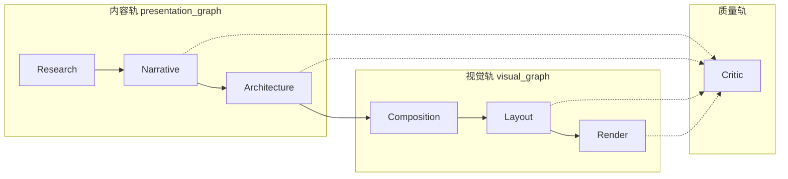

# Pipeline 逻辑角色（Role Logic）

> **设计原则**：借鉴 PPTAgent / DeepPresenter 的**阶段责任与输出契约**，不照搬「很多 Agent」。
> 阿基姆用 **Service + Domain 模型 + Workflow 图** 承载角色；`archium/agents/` 仅保留少量 LLM planner，**不**为每个角色新建长期 Agent 类。

## 为何需要「角色」而不是「Agent 类」

| 外部参考 | 做法 | 阿基姆借鉴点 | 阿基姆避免 |
|----------|------|-------------|-----------|
| **PPTAgent** | `editor` / `coder` / `content organizer` / `layout selector` | 每阶段有清晰输入输出；语义层与几何层分离 | 同名四类 Agent、第二套 PPT 内核 |
| **DeepPresenter** | Planner → Research → PPTAgent/Design → 导出 | 主链阶段可组合、可跳过 | SubAgent 爆炸、运行时 Agent 环境复制 |

**正确抽象**：七个**逻辑角色**（Role）——每个角色对应一类责任、一组服务入口、一份**领域产物（Artifact）**。实现可以是 service、workflow node、或单次 LLM 调用，**不必**是 `class XxxAgent`。

## 七角色总览



| 角色 | 一句话职责 | 核心产物（Artifact） | 主要实现形态 |
|------|-----------|---------------------|-------------|
| **Research** | 事实、资料、来源、可引用证据 | `Fact`、资料片段、`PresentationManuscript`、`Citation` | Service + ingestion workflow |
| **Narrative** | 大纲、故事线、章节节奏、页级意图 | `Brief`、`Storyline`、`OutlinePlan`、`SlideSpec` | 少量 `*Planner` Agent + `presentation_service` |
| **Architecture** | 建筑专业语义、问题—策略—证据关系 | `ArchitecturalContentSchema`、`IssueMap`、schema affinity | Service + 领域 schema（非几何） |
| **Composition** | Deck 节奏、页功能类型、视觉意图分配 | `DeckCompositionPlan`、`ArtDirection`、`VisualIntent` | `application/visual/*composition*` |
| **Layout** | 单页版式、元素几何、槽位绑定 | `LayoutPlan`、`RenderScene`（结构层） | `layout_planning_service` + generators |
| **Render** | 可打开的输出文件与场景实例化 | PPTX / PDF / PNG、`RenderedSlideInstruction` | PptxGen execute-only、scene compiler |
| **Critic** | 发现**具体问题**（可修复项），非泛泛打分 | `ReviewFinding`、`LayoutIssue`、`VisualCritique` | `application/review/*`（与 Repair 分离授权） |

## 角色详解与代码映射

### 1. Research Role

**责任**：从项目资料中提取可验证事实与来源，**不**写汇报修辞。

| 类型 | 路径 |
|------|------|
| Workflow | `retrieve_context` → `extract_facts` → `validate_facts`（`archium/workflow/nodes/ingestion.py`） |
| Service | `ingestion_service.py`、`presentation_manuscript_service.py` |
| Agent（LLM 辅助） | `citations.py`、RAG via `agents/_helpers.py` |
| Domain | `presentation_manuscript.py`、`Citation`、`Asset` |
| WorkflowStep | `RETRIEVE_CONTEXT`、`EXTRACT_FACTS`、`VALIDATE_FACTS`、`RESOLVE_CITATIONS`、`MATCH_ASSETS` |

**输出契约**：事实带来源；禁止把参考 PPT 案例文本写入 manuscript 事实层。

---

### 2. Narrative Role

**责任**：把事实组织为可汇报的叙事结构（章节、关键信息、拆页）。

| 类型 | 路径 |
|------|------|
| Agent | `narrative_architect.py`、`outline_planner.py`、`slide_planner.py`、`brief_builder.py` |
| 场景特化 | `cultural_narrative_planner.py`、`renovation_issue_planner.py`（偏 Architecture 边界） |
| Service | `presentation_service.py`、`outline_service.py` |
| Domain | `Brief`、`Storyline`、`OutlinePlan`、`SlideSpec` |
| WorkflowStep | `BRIEF`、`STORYLINE`、`OUTLINE`、`SLIDES` + 各 `REVIEW_*` |

**输出契约**：`SlideSpec` 只含**项目内容**（title / message / key_points / citations），不含参考模板坐标。

---

### 3. Architecture Role

**责任**：建筑汇报的**专业语义**——页面要证明什么、问题与策略如何对应、需要什么类型的证据与图纸。

| 类型 | 路径 |
|------|------|
| Schema 契约 | `architectural_content_schema.py`（PPTAgent 风格**语义层**，非几何 slot） |
| 提取 / 填充 | `architectural_content_schema_extractor.py`、`semantic_content_plan.py` |
| 模板归纳 | `template_induction_service.py`、`reference_slide_matcher.py` |
| Co-plan | `outline_template_co_planning_service.py`（outline section ↔ schema affinity） |
| 问题—策略 | `renovation_issue_planner.py`、review `architectural.py` |
| Domain | `ContentRole`、`VisualRequirement`、`ArchitecturalTemplate` |

**输出契约**：`ArchitecturalContentSchema` 描述「这页需要 central_claim / evidence / visual_evidence」，**不**绑定参考 PPT 里的案例文字或 `reference_template` 资产。

**与 PPTAgent `content organizer` 的对应**：`semantic_content_plan.build_semantic_content_plan()` + schema `hydrate_semantic_contract()`——组织「内容需求」，不是排版。

---

### 4. Composition Role

**责任**：整份 deck 的节奏与功能分配——哪些页是封面、问题、策略、图纸焦点、收束。

| 类型 | 路径 |
|------|------|
| Service | `deck_composition_service.py`、`enhanced_deck_composition_service.py` |
| 视觉方向 | `art_direction_service.py`、`visual_intent_service.py` |
| 模板合成 | `template_composition_service.py` |
| WorkflowStep | `VISUAL_GENERATE_DECK_COMPOSITION`、`VISUAL_GENERATE_ART_DIRECTION`、`VISUAL_GENERATE_INTENTS` |

**输出契约**：`DeckCompositionPlan` / `VisualIntent` 指定页功能与视觉意图；**不**含绝对坐标。

详见 [`DECK_COMPOSITION_ARCHITECTURE.md`](DECK_COMPOSITION_ARCHITECTURE.md)。

---

### 5. Layout Role

**责任**：单页元素几何、版式族选择、文本/图槽绑定。

| 类型 | 路径 |
|------|------|
| Service | `layout_planning_service.py`（`generate_candidates` / `select_best`） |
| 校验修复 | `layout_validation_service.py`、`layout_repair_service.py` |
| 基础设施 | `archium/infrastructure/layout/`（Registry + 确定性 generators） |
| 模板匹配 | `template_layout_matcher.py` |
| 参考页编辑 | `reference_slide_editing_service.py`（复制参考结构 → `RenderScene`） |
| WorkflowStep | `VISUAL_GENERATE_LAYOUT_CANDIDATES`、`VISUAL_SELECT_LAYOUTS`、`VISUAL_VALIDATE_LAYOUTS`、`VISUAL_REPAIR_LAYOUTS` |

**输出契约**：`LayoutPlan` 或 `RenderScene` 含坐标与节点树；项目内容来自 `SlideSpec`，参考资产不得进入 `asset_manifest`。

**与 PPTAgent `layout selector` 的对应**：`LayoutPlanningService.select_best()`、`template_layout_matcher`、co-plan 的 `fallback_mode` 路由（`template_editing` vs `free_composition`）。

---

### 6. Render Role

**责任**：把已批准的计划**执行**为可交付文件；渲染阶段**不重做**叙事或选版式。

| 类型 | 路径 |
|------|------|
| Workflow | `VISUAL_RENDER`（`archium/workflow/visual_nodes.py`） |
| PPTX | `infrastructure/renderers/pptxgen/` + `render-plan.mjs`（execute-only） |
| Scene | `render_scene_compiler.py`、`reference_slide_editing_service.py` |
| Studio | `studio_scene_service.py`、`slide_edit_execution_service.py` |
| Legacy | Marp / JSON export（presentation graph） |

**输出契约**：PPTX/PDF/PNG 可打开；`render-plan.mjs` **禁止**重选版式族或重算版心（见 [`docs/visual/architecture.md`](../visual/architecture.md)）。

**与 PPTAgent `coder` / `editor` 的对应**：execute 路径（PptxGen、scene compile、reference strip-and-fill）——**改内容绑定点**，不在 render 里做 LLM 编排。

---

### 7. Critic Role

**责任**：列出**可操作的**问题清单；是否阻断导出、是否触发修复由策略决定。

| 类型 | 路径 |
|------|------|
| 四层审核 | `application/review/service.py` → Content / Evidence / Architectural / Layout |
| 语义 / 场景 | `slide_semantic.py`、`scene_render_qa.py` |
| 视觉只读 | `visual_critic_service.py`、`deck_qa_service.py`（**不**调用 repair、**不**阻断正式导出） |
| 修复（非 Critic） | `slide_repair_service.py`、`layout_repair_service.py`、`deck_repair_service.py` |
| WorkflowStep | `CONTENT_REVIEW` … `LAYOUT_REVIEW`、`VISUAL_CRITIQUE`、`REPAIR_SLIDES` |

**输出契约**：`ReviewFinding` 含 layer、severity、message、可选 `suggested_fix`；Critic **不**直接改稿。

---

## 三条并行轨道

阿基姆不是单线 Planner→Design，而是三条可组合的轨道：

| 轨道 | 触发场景 | 角色覆盖 |
|------|---------|---------|
| **Presentation graph** | 默认汇报生成 | Research → Narrative →（轻量 Architecture review）→ Critic → Export |
| **Visual graph** | 可选视觉编排 | Composition → Layout → Render → Critic（只读视觉） |
| **Template induction** | 参考 PPTX 归纳模板（Phase 3–6） | Architecture（schema）→ Composition（co-plan）→ Layout（template_editing）→ Render（RenderScene） |

```
Presentation:  资料 → Brief → Storyline → Outline → SlideSpec → 四层 Review → JSON/Marp
Visual:        SlideSpec → ArtDirection → VisualIntent → LayoutPlan → PPTX
Induction:     参考PPTX → Schema/Template → Co-plan → ReferenceSlideEditing → RenderScene
```

Induction 轨与 PPTAgent 最接近的是 **Architecture + Layout + Render** 的契约分层，仍走阿基姆 `RenderScene`，不是平行内核（见 `docs/QUALITY_GATE_STATUS.md` § Template Induction）。

## Agent 类边界（刻意保持稀少）

`archium/agents/` 当前仅保留**需要 LLM 且边界清晰**的 planner：

| Agent | 主要角色 |
|-------|---------|
| `brief_builder` | Narrative |
| `narrative_architect` | Narrative |
| `outline_planner` | Narrative |
| `slide_planner` | Narrative |
| `cultural_narrative_planner` | Narrative + Architecture |
| `renovation_issue_planner` | Architecture |
| `citations` | Research |
| `reference_style_profiler` | Composition（风格，非版式） |

**不应新增**：`ResearchAgent`、`LayoutAgent`、`RenderAgent`、`CriticAgent` 等——对应能力已在 service / workflow node 中。

## 与 E2E 验收 stage 的对照

`tests/e2e/real_projects/*/project_profile.json` 使用另一套词汇（`ingest`、`research`、`outline_confirmation` …）。对照关系：

| E2E stage | 逻辑角色 |
|-----------|---------|
| `ingest` | Research |
| `research` | Research |
| `outline_confirmation` | Narrative |
| `slides` | Narrative |
| `deck_composition` | Composition |
| `layout` | Layout |
| `pptx_export` | Render |
| `studio_edit` | Render（人工） |
| `human_review` | Critic（人工） |
| `final_acceptance` | Critic（门禁） |

## 已知缺口（刻意不假装已完成）

1. **无 `PipelineRole` 枚举**——角色仅本文档 + 工程师约定；`WorkflowStep` / `ReviewLayer` 是另一套粒度。
2. **Architecture 分散**——renovation planner、schema induction、architectural reviewer 三处；尚未有单一 `ArchitectureService` facade。
3. **Narrative ↔ Composition 弱耦合**——deck composition 在 visual graph；outline 在 presentation graph；靠 `SlideSpec` / co-plan 衔接。
4. **Critic 权限分裂**——内容/版面 review 可触发 repair；visual critic 只读——需在 UI 上区分「阻断项」与「建议项」。
5. **Template induction Phase 4–6**——edit-based `RenderScene` 与 LayoutPlan 主路径仍在收敛，见质量门文档。

## 非目标

- 不为每个角色新建 Agent 类或 SubAgent 树。
- 不引入 DeepPresenter 式 Agent Environment。
- 不把 PPTAgent 的 editor/coder 抄成同名类；只保留**职责等价**的 service 边界。
- 不在 render 阶段重新做 layout selection 或 narrative 改写。

## 相关文档

- 主链总览：[`README.md`](../../README.md) § 完整主链
- 视觉分层：[`docs/visual/architecture.md`](../visual/architecture.md)
- Deck 节奏：[`DECK_COMPOSITION_ARCHITECTURE.md`](DECK_COMPOSITION_ARCHITECTURE.md)
- 任务规划：[`docs/project-mission-adaptive-planning.md`](../project-mission-adaptive-planning.md)
- 模板归纳质量门：[`docs/QUALITY_GATE_STATUS.md`](../QUALITY_GATE_STATUS.md)

---

*Last updated: 2026-07-21 — 与 Template Induction / semantic_content_plan / co-plan template_editing 接线同步。*
