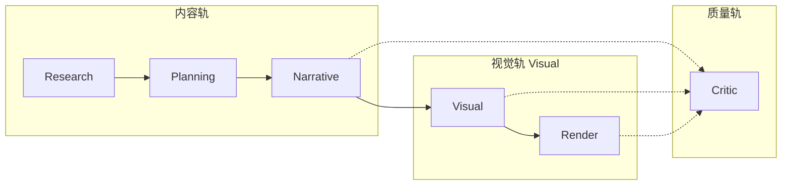

# Pipeline 逻辑角色（Role Logic）

> **设计原则**：借鉴 PPTAgent / DeepPresenter 的**阶段责任与输出契约**，不照搬「很多 Agent」。
> 阿基姆用 **Service + Domain 模型 + Workflow 图** 承载角色；`archium/agents/` 仅保留少量 LLM planner，**不**为每个角色新建长期 Agent 类。

## 产品侧 Agent 数量（硬上限）

**不要继续增加 Agent。** 禁止出现 `ArchitectureAgent2` / `VisualAgent3` / `LayoutAgent4` 一类编号分叉。

产品侧只保持这 **六个** 逻辑席位：

| # | 角色 | 一句话 |
|---|------|--------|
| 1 | **Research** | 事实、资料、来源 |
| 2 | **Planning** | 任务 / 成果 / 工作路径（Mission） |
| 3 | **Narrative** | 大纲、故事线、页级意图 |
| 4 | **Visual** | 视觉意图、构图、版式、图片处理（内部可再拆阶段） |
| 5 | **Render** | 执行已批准场景 → 可打开的文件 |
| 6 | **Critic** | 列出可修复问题，不静默改稿 |

实现可以是 service、workflow node、或单次 LLM 调用，**不必**是 `class XxxAgent`。
能力增长优先落在现有席位的 **Service / Domain 产物**，而不是新开 Agent。

## 为何需要「角色」而不是「Agent 类」

| 外部参考 | 做法 | 阿基姆借鉴点 | 阿基姆避免 |
|----------|------|-------------|-----------|
| **PPTAgent** | `editor` / `coder` / `content organizer` / `layout selector` | 每阶段有清晰输入输出；语义层与几何层分离 | 同名四类 Agent、第二套 PPT 内核 |
| **DeepPresenter** | Planner → Research → PPTAgent/Design → 导出 | 主链阶段可组合、可跳过 | SubAgent 爆炸、运行时 Agent 环境复制 |

**正确抽象**：产品六席位（上表）+ 可选的 **Visual 内部阶段标注**（Architecture / Composition / Layout）——后者只是代码与 E2E 的细粒度标签，**不是**新的 Agent。

## 认知核（产品对话）↔ 六席位（实现）

对外讲「建筑 AI」时，用 **约五个认知核** 即可，避免 Concept / Design / Strategy 再拆成多个 Agent。
对内实现仍严格落在 **六个席位 + Service**，**禁止**新增 `ContextAgent` / `ReasoningAgent` / `PresentationAgent` 等类。

```text
              Architectural AI
                      |
          +-----------+------------+
          |                        |
   Context Intelligence     Architectural Reasoning
          |                        |
       Research                 Critic
                      |
           Presentation Delivery
           (Narrative → Visual → Render)
```

| 认知核（对外） | 一句话 | 映射席位（对内） | 主要实现（示例） |
|----------------|--------|------------------|------------------|
| **Context Intelligence** | 理解项目：知多少、缺什么、下一步 | Research 的认知面（非修辞）+ 与 Planning 的闸门协作 | `ContextAnalyzer`、`KnowledgeState`、NBA、`presentation_cognition_gate` |
| **Architectural Reasoning** | 建筑推理：问题—策略—概念—意图（**合一，勿再拆**） | Planning（Mission / 方向 / Intent）∪ Visual 内部 Architecture 语义 | Exploration、`ConceptDirection`、`DesignIntent`、renovation issue map |
| **Research** | 外部与项目知识获取 | Research | 摄取、Fact/Knowledge、`AutonomousResearchService`（有界环） |
| **Critic** | 质疑：设计方向 + 汇报/视觉表达 | Critic | `DesignCritiqueService`、`application/review/*`、visual critic |
| **Presentation Delivery** | 把设计思想变成可交付汇报 | **Narrative → Visual → Render**（三阶，不合成一个 Agent） | Brief/Storyline/SlideSpec → Layout/Scene → PPTX |

### 映射纪律

1. **Context 是能力包，不是第七席位**：产品可单独说 Context Intelligence；代码仍挂在现有 Service / KS 产物上。
2. **Reasoning 禁止再拆**：不出现 `ConceptAgent` / `DesignAgent` / `StrategyAgent`；概念探索与设计意图同属一核。
3. **Planning 不被 Reasoning 吞没**：Mission / 交付物 / 工作流路径仍是 Planning 席位产物——「做什么项目」≠「空间怎么想」。
4. **Presentation 保持三阶**：Narrative 写什么、Visual 怎么看、Render 出文件；合并成一个 Presentation Agent 会重新诱发 LayoutAgent 式膨胀。
5. **Critic 双通道、同一席位**：设计批判（概念选定前）与页级/视觉 QA（表达）共用 Critic，产物不同、都不静默改稿。

### 与「五个 Agent」提案的关系

社区常见的五 Agent 图（Context / Reasoning / Research / Critic / Presentation）**精神正确**（少而精）。
Archium 的落地选择是：

- 用上表做 **产品叙事与能力分组**；
- 用六席位做 **代码边界与 Workflow 授权**；
- **不**把认知核落成五个长期 `class XxxAgent`。

## 六席位总览


```mermaid
flowchart LR
  subgraph content["内容轨"]
    R[Research]
    P[Planning]
    N[Narrative]
  end
  subgraph visual["视觉轨 Visual"]
    V[Visual]
    Ren[Render]
  end
  subgraph qa["质量轨"]
    Cr[Critic]
  end
  R --> P --> N --> V --> Ren
  N -.-> Cr
  V -.-> Cr
  Ren -.-> Cr
```

| 角色 | 一句话职责 | 核心产物（Artifact） | 主要实现形态 |
|------|-----------|---------------------|-------------|
| **Research** | 事实、资料、来源、可引用证据 | `Fact`、资料片段、`PresentationManuscript`、`Citation` | Service + ingestion workflow |
| **Planning** | 任务澄清、工作路径、成果选择 | `Mission`、`PlanningSession`、`DeliverablePlan` | `planning_workflow_service` 等 |
| **Narrative** | 大纲、故事线、章节节奏、页级意图 | `Brief`、`Storyline`、`OutlinePlan`、`SlideSpec` | 少量 `*Planner` + `presentation_service` |
| **Visual** | 专业语义 + deck 节奏 + 单页几何 + 图片管线 + **Vision Engine（概念/图示/氛围生成）** | Schema / `VisualIntent` / `LayoutPlan` / Scene / `ai_generated` Asset | `application/visual/*`（**非**新 Agent） |
| **Render** | 可打开的输出文件与场景实例化 | PPTX / PDF / PNG | PptxGen execute-only、scene compiler |
| **Critic** | 发现**具体问题**（可修复项），非泛泛打分 | `ReviewFinding`、`LayoutIssue`、`VisualCritique` | `application/review/*`（与 Repair 分离授权） |

### Visual 内部阶段（标注用，不是 Agent）

代码与 E2E 仍可能使用细粒度 `PipelineRole`：`architecture` / `composition` / `layout`。它们全部归入产品席位 **Visual**：

| 内部阶段 | 含义 |
|----------|------|
| Architecture | 建筑专业语义、问题—策略—证据关系（schema） |
| Composition | Deck 节奏、页功能、`VisualIntent` |
| Layout | 单页几何、`LayoutPlan` / Scene 结构 |

产品对话与路线图只说 **Visual**，不要再开 `LayoutAgent` / `CompositionAgent`。

## 角色详解与代码映射

### 1. Research Role

**责任**：从项目资料中提取可验证事实与来源，**不**写汇报修辞。

| 类型 | 路径 |
|------|------|
| Workflow | `retrieve_context` → `extract_facts` → `validate_facts`（`archium/workflow/nodes/ingestion.py`） |
| Service | `ingestion_service.py`、`presentation_manuscript_service.py`、`knowledge_fusion.py`、`retrieval_service.py` |
| Agent（LLM 辅助） | `citations.py`、RAG via `agents/_helpers.py` |
| Domain | `presentation_manuscript.py`、`Citation`、`Asset`、`architectural_chunk.py`、`knowledge_reference.py` |
| WorkflowStep | `RETRIEVE_CONTEXT`、`EXTRACT_FACTS`、`VALIDATE_FACTS`、`RESOLVE_CITATIONS`、`MATCH_ASSETS` |

**输出契约**：事实带来源；禁止把参考 PPT 案例文本写入 manuscript 事实层。  
**Phase I**：检索命中优先为带可信度的 `KnowledgeReference`，而非纯文本 Top-K。

---

### 2. Planning Role

**责任**：弄清「做什么、交付什么、走哪条工作路径」，**不**写页文案、**不**排版。

| 类型 | 路径 |
|------|------|
| Workflow | `PlanningWorkflowService`、Mission / Deliverable / Workstream 闸门 |
| Domain | `Mission`、`PlanningSession`、`DeliverablePlan` |
| 文档 | [`docs/project-mission-adaptive-planning.md`](../project-mission-adaptive-planning.md) |

**输出契约**：可批准的任务与成果计划；创建 Presentation 前不假装已有最终稿。

---

### 3. Narrative Role

**责任**：把事实组织为可汇报的叙事结构（章节、关键信息、拆页）。

| 类型 | 路径 |
|------|------|
| Planner（propose） | `agents/narrative_architect.py`、`outline_planner.py`、`brief_builder.py` 等 |
| 场景特化 | `cultural_narrative_planner.py`、`renovation_issue_planner.py`（偏 Visual 边界） |
| Service | `application/narrative/*`、`presentation_service.py` |
| Domain | `Brief`、`Storyline`、`OutlinePlan`、`SlideSpec` |
| WorkflowStep | `BRIEF`、`STORYLINE`、`OUTLINE`、`SLIDES` + 各 `REVIEW_*` |

**输出契约**：`SlideSpec` 只含**项目内容**（title / message / key_points / citations），不含参考模板坐标。

**与 Cognition 的衔接（Phase A）**：汇报入口（`PresentationWorkflowService.prepare_run`）经
`presentation_cognition_gate` 读取 `ProjectContext` / `KnowledgeState`，产出
`proceed | warn | block` + 建议 NBA；`BriefService` 把完备性摘要注入 LLM 上下文。
策略开关：`PRESENTATION_COGNITION_GATE`（默认 `warn`）。

**Phase B（可测 Policy）**：`actions_for_presentation_entry` 决定「汇报将启动」时的 NBA；
`research_topics` 按设计影响轴（约束 / 类型 / 文化 / 阻断未知）排序研究主题，供自主研究消费。

**Phase C（有界研究环）**：`AutonomousResearchService` 按步执行
topic → search → write → INDEX reassess；停条件为 max_steps /
`research_need` 阈值 / 主题耗尽 / 空产出。产物为 `ResearchRun`（非新 Agent）。

**Phase E（角色级 Evaluation）**：`tests/evaluation/` 用 Mock LLM 断言席位产物义务
（ConceptDirection 空间策略/形式语言/风险、`DesignIntent.social_background`、
研究条目 `source_citations`、Critic `alternative_directions`）。不是 `tests/agents/`。

**Phase F（Prompt 推理框架）**：`archium/prompts/frameworks/` 提供共享
Architectural Reasoning / Design Critique / Research→Knowledge 片段；
Concept、概念 Mission、自主研究、设计批判 SYSTEM 注入同一工序（非角色扮演）。
任务 Prompt 带轻量 `PROMPT_VERSION`（如 `concept_direction.v2`）。

**Phase G（LLM Runtime）**：`LLMRuntime` + `LLMCapability` 将任务映射到既有
`ModelRole`；主链（Concept / Mission / Research / Critique）经 `call.generate_structured`
记录 `LLMTrace`（tokens / latency / prompt_version）。不在 Agent 内选模型。

**Phase H（Research → DesignKnowledge）**：自主研究 finding 结构化为
`DesignKnowledge`（principle / spatial_translation / evidence…）并落库；
Concept / Critique 注入已沉淀设计知识块，不再只消费散文 statement。

**Phase H.1（ResearchQuestion）**：`ResearchQuestionService` 从 DesignIntent / KS
拆解分类问题（Social/Cultural/Architectural…），改写「案例堆砌」为问题表述；
`research_topics` / 自主研究优先消费问题，而非裸关键词。

**Phase H.2（ArchitectureCase）**：种子案例库 + 标签/问题重叠检索（非向量 RAG）；
支持跨类型迁移（如「冥想」→ 温泉/小教堂）；注入 Concept / Research 语境，
并可映射为 `DesignKnowledge`。

**Phase H.3（Research Critic）**：`ResearchCritiqueService` 对研究产物打
`validity` / `design_relevance`，标记 background_only / weak_citation / over_analogy；
默认规则批判（`RESEARCH_CRITIQUE_MODE=warn`），可选 LLM 合并。

**Phase H.4（Research→Vision）**：`ResearchVisionBridgeService` 将
`DesignKnowledge` / `ArchitectureCase` 映射为 `ResearchVisionBundle`
（空间分析图 / 概念草图 / 现代转译图种子）；自主研究结束后挂到
`AutonomousResearchResult.vision_bundles`。只产 Vision Engine `ImageRequest` 种子，
**不**自动出像素；闸门仍是 `vision_image_generation_enabled`。

**Phase I（Retrieval P0 · 建筑知识检索）**：`ArchitecturalChunkType` 标注文档块；
Chroma 支持 `RetrievalFilters`（content_type / architectural_type / document_id）；
`KnowledgeFusionService` 将 Fact + Chunk + KnowledgeItem（+ Case）融合为
带 `similarity` / `authority` / `transferability` 的 `KnowledgeReference`，
避免纯 Top-K 文本 RAG。

**Phase I.1（Retrieval P1）**：`retrieval_credibility` 将权威度/可迁移性深入
chunk rerank 与融合打分（低 authority 证据降权、低 transferability 封顶）；
`KnowledgeVectorIndexService` 把 `ProjectKnowledge` / `DesignKnowledge` 写入同一
Chroma 项目集合（`record_type=knowledge_item`），创建/确认时索引，融合检索消费向量命中。

**Phase I.2（Retrieval P2）**：`KnowledgeGraphService` 构建建筑知识图谱
（Case/Architect/Space/Material/Tag/Concept + Project Knowledge 边），1-hop 扩展检索；
`MultimodalRetrievalService` 对 `asset_caption` 做视觉特征标注与检索，预留
`ImageEmbeddingProvider` / CAD·BIM 通道（暂无 IFC/DWG 解析）。均经
`KnowledgeFusionService` 汇入 `KnowledgeReference`。

**Phase I.3（产品面接线）**：检索预览展示 KnowledgeReference（含图谱/多模态通道）；
自主研究后可展开 Research→Vision 种子，并一键写入空 `ConceptDirection.visual_prompt`。

**Phase J（建筑设计逻辑层 P0）**：`SpatialIntent` + `DesignRule` 挂在
`ConceptDirection` / `DesignIntent`；生成与选定时确定性回填；选定方向把空间层写入
Mission。`DesignRationale` 增加观察/问题/假设/策略/风险；`DesignDecision` 写入
`IntentEvolution`（`DESIGN_DECISION`）。解决「概念口号 → 空间规则」断层。
UI：概念方向详情、Mission 设计使命、意图演进时间线展示空间意图/规则/决策。

**Phase K（编排 Decision Router P0）**：`replan_from_context` 在 `advance` 时按
`ProjectContext` / `RecommendedWorkflow` 重写 PENDING 尾部（保留已完成与 in-flight）；
统一 `HumanGate`；研究/批评后写入 `DesignReflection`（`IntentEvolution.REFLECTION`）。
UI：编排条展示闸门/反思，支持「继续编排」与「按上下文重规划」。
从「跑完固定阶段」迈向「按知识状态管理设计过程」。

**Phase K.1（P1）**：编排 `process_timeline`（阶段/闸门/重规划/反思过程史，链到
IntentEvolution kind）；Planning `WorkflowRun` 快照 `mission_id`-first 瘦身；
探索选定批判后补 `REFLECTION`。

**Phase L（PresentationIntent / SlideRole P0）**：`PresentationIntent` 挂 Brief/Request
（说服策略、视觉风格、深度、受众模式）；`SlideRole` + `VisualStrategy` 收敛
PageArchetype/NarrativeStage/SlideType；生成时回填并持久化；确定性
`PresentationCritic` 聚合故事/视觉/建筑表达评分，并挂入 presentation 图
`run_presentation_critique`（layout 之后、repair/validate 之前，软失败）。
从「页目录」迈向「受众说服叙事」。

**Phase M（UI / Product Experience P0–P1）**：伙伴面而非功能管理器。
- Genesis 保持一句话入口；Knowledge 文案去 % 仪表盘，改为「已知 / 仍缺 / 下一步」
  （`render_ai_understanding_panel`）。
- 概念探索：左「思考与建议」+ 右「方案比较」三列卡（`concept_direction_compare`）。
- Project Home：挂 AI 理解、NBA、IntentEvolution 最近变化。
- Mission 方向区同步比较卡；视觉环文案改为「探索视觉表达」并绑 DesignIntent 摘要。

**Phase M.1（UI P2）**：Studio / Outline 故事线第一公民 + Visual Thinking 分槽。
- Studio：左故事线（章目的/关键信息 + 链到大纲编辑）· 中画布 · 右常驻「本页 AI 建议」
  + 检查器；顶部项目理解面板。
- Outline：右栏任务元数据下挂页意图 AI 建议（`outline_partner_suggestions`）。
- Visual Thinking：氛围/空间/材料/体量四槽（`visual_thinking_slots` + panel），
  挂概念探索与 Mission；图绑 DesignIntent 字段。
仍待：完整 Chat 会话轨、Storyline 字段在 Studio 内联编辑（现链回大纲阶段）。

**Phase N（Engineering Foundation P0）**：长期产品记忆与可观测性。
- `project_events` 统一事件账本：创建 / IntentEvolution 投影 / process_timeline 投影
  （`ProjectEventService`；`ProjectRepository` / `WorkflowRunRepository` 自动同步）。
- `llm_traces` 持久化 LLMTrace（tokens/latency/capability；禁 prompt/密钥）；
  `FanoutLLMTraceRecorder` = 内存 + DB（`llm_trace_persist_enabled`）。
- `JobProgressService` 统一 WorkflowRun + ArtifactJob 进度视图；Home 展示事件记忆与任务进度。

**Phase N.1（Engineering P1）**：
- 项目级模型档位 `fast` / `quality`（`ProjectLLMTierService` + `llm_fast_model` /
  `llm_quality_model`；Home 可选；`get_effective_settings(project_id=…)` 生效）。
- Workflow 完成时写入 `PRESENTATION_GENERATED` 事件；编排条挂任务进度。
- Evaluation：`tests/evaluation/test_presentation_quality_eval.py`（Intent / Storyline /
  SlideRole / PresentationCritic 契约）。
仍待：独立 Worker 队列、团队 RBAC、CAD/BIM 资产解析。

---

### 4. Visual Role（含内部 Architecture / Composition / Layout）

**责任**：从专业语义与视觉意图，落到可渲染的版式与图片处理；**不**替代 Narrative 写故事，**不**在本角色内导出最终 PPTX（那是 Render）。

#### 4a. Architecture（内部）

| 类型 | 路径 |
|------|------|
| Schema 契约 | `architectural_content_schema.py` |
| 提取 / 填充 | `architectural_content_schema_extractor.py`、`semantic_content_plan.py` |
| 模板归纳 | `template_induction_service.py`、`reference_slide_matcher.py` |
| Co-plan | `outline_template_co_planning_service.py` |
| 问题—策略 | `renovation_issue_planner.py`、review `architectural.py` |

**输出契约**：语义需求（claim / evidence），**不**绑定参考案例文字。

#### 4b. Composition（内部）

| 类型 | 路径 |
|------|------|
| Service | `deck_composition_service.py`、`art_direction_service.py`、`visual_intent_service.py` |
| WorkflowStep | `VISUAL_GENERATE_DECK_COMPOSITION`、`VISUAL_GENERATE_ART_DIRECTION`、`VISUAL_GENERATE_INTENTS` |

**输出契约**：`DeckCompositionPlan` / `VisualIntent`；**不**含绝对坐标。详见 [`DECK_COMPOSITION_ARCHITECTURE.md`](DECK_COMPOSITION_ARCHITECTURE.md)。

#### 4c. Layout（内部）

| 类型 | 路径 |
|------|------|
| Service | `layout_planning_service.py`、`layout_validation_service.py`、`layout_repair_service.py` |
| 基础设施 | `archium/infrastructure/layout/` |
| WorkflowStep | `VISUAL_GENERATE_LAYOUT_CANDIDATES`、`VISUAL_SELECT_LAYOUTS`、… |

**输出契约**：`LayoutPlan` / Scene 结构节点；项目内容来自 `SlideSpec`。

#### 4d. Vision Engine（战略缺口 → 见专章）

创造概念图 / 分析示意 / 氛围图 / 手绘感插图，经 Prompt Compiler → 可插拔 Image API → Asset（`ai_generated`）→ Studio/Layout。  
**不是** Midjourney 套壳；证据槽默认禁止生成图冒充现场。详见 [`vision-intelligence-layer.md`](vision-intelligence-layer.md)。

**Research→Vision（Phase H.4）**：研究洞察经 `research_vision_bridge.py` 生成
三类示意种子，再由既有 `VisualConceptBriefService` / `VisionImageGenerationService` 消费。

---

### 5. Render Role

**责任**：把已批准的计划**执行**为可交付文件；渲染阶段**不重做**叙事或选版式。

| 类型 | 路径 |
|------|------|
| Workflow | `VISUAL_RENDER`（`archium/workflow/visual_nodes.py`） |
| PPTX | `infrastructure/renderers/pptxgen/` + `render-plan.mjs`（execute-only） |
| Scene | `render_scene_compiler.py`、`studio_scene_service.py` |
| Legacy | Marp / JSON export（presentation graph） |

**输出契约**：PPTX/PDF/PNG 可打开；`render-plan.mjs` **禁止**重选版式族（见 [`docs/visual/architecture.md`](../visual/architecture.md)）。

---

### 6. Critic Role

**责任**：列出**可操作的**问题清单；是否阻断导出、是否触发修复由策略决定。

| 类型 | 路径 |
|------|------|
| 四层审核 | `application/review/service.py` |
| 语义 / 场景 | `slide_semantic.py`、`scene_render_qa.py` |
| 视觉只读 | `visual_critic_service.py`、`deck_qa_service.py` |
| **设计批判（Phase D）** | `design_critique_service.py` → `DesignCritiqueReport` |
| **研究批判（Phase H.3）** | `research_critique_service.py` → `ResearchCritiqueReport` |
| Domain | `ReviewIssue`、`VisualCriticReport`、`design_critique.py` |
| 修复（非 Critic） | `slide_repair_service.py`、`layout_repair_service.py`、`deck_repair_service.py` |

**输出契约**：`ReviewFinding` / `DesignCritiqueReport`；Critic **不**直接改稿。

**Architectural Critic**：在 Exploration / Mission `select_direction` 前质疑概念方向
（strengths / weaknesses / missing_evidence / alternative_directions）。
闸门：`DESIGN_CRITIQUE_ON_SELECT`（默认 `warn`）。写入 IntentEvolution
`DESIGN_CRITIQUE`，不静默改方向。

**评价契约（Phase E）**：见 `tests/evaluation/`（Critic 必须给出 counterexample 方向）。

---

## 三条并行轨道

| 轨道 | 触发场景 | 角色覆盖 |
|------|---------|---------|
| **Presentation graph** | 默认汇报生成 | Research → Planning（若走 Mission）→ Narrative → Critic → Export |
| **Visual graph** | 可选视觉编排 | Visual（Composition→Layout）→ Render → Critic |
| **Template induction** | 参考 PPTX 归纳 | Visual 内部阶段 → Render |

```
Presentation:  资料 → Brief → Storyline → Outline → SlideSpec → Review → 导出
Visual:        SlideSpec → ArtDirection → VisualIntent → LayoutPlan → PPTX
Induction:     参考PPTX → Schema/Template → Co-plan → ReferenceSlideEditing → RenderScene
```

## Agent 类边界（刻意保持稀少）

`archium/agents/` 仅保留 **LLM propose（无 Session / 无 persist）** 的 planner。
持久化与编排在 `application/narrative/*Service`（Brief / Storyline / Outline / SlidePlan 等）。

| Planner（propose） | 主要角色 | Service（persist） |
|-------|---------|-------------------|
| `brief_builder` | Narrative | `BriefService` |
| `narrative_architect` | Narrative | `StorylineService` |
| `outline_planner` | Narrative | `OutlinePlanService` |
| —（LLM 仍内联） | Narrative | `SlidePlanService` |
| `cultural_narrative_planner` | Narrative + Visual | `CulturalNarrativeService` |
| `renovation_issue_planner` | Visual（专业语义） | `RenovationIssueMapService` |
| `citations`（兼容 re-export） | Research | `application/citation_resolution.py` |
| `reference_style_profiler` | Visual（风格，非版式） | `ReferenceStyleProfileService` |

**严禁新增**：

- `ResearchAgent` / `PlanningAgent` / `NarrativeAgent` / `VisualAgent` / `RenderAgent` / `CriticAgent`
- 任何编号分叉：`ArchitectureAgent2`、`VisualAgent3`、`LayoutAgent4`、…
- 为 Layout / Composition / Architecture 单独长期 Agent 类

对应能力进 **现有六席位下的 Service / Workflow node**。

## 与 E2E 验收 stage 的对照

| E2E stage | 产品席位 | 内部 PipelineRole（若有） |
|-----------|---------|---------------------------|
| `ingest` / `research` | Research | research |
| Mission / deliverable 规划 | Planning | planning |
| `outline_confirmation` / `slides` | Narrative | narrative |
| `deck_composition` | Visual | composition |
| `layout` | Visual | layout |
| `pptx_export` / `studio_edit` | Render | render |
| `human_review` / `final_acceptance` | Critic | critic |

代码映射见 `archium/domain/pipeline_role_mapping.py`（含 `to_product_agent_role`）。

## 已知缺口（刻意不假装已完成）

1. **`PipelineRole` 细粒度标注**仍含 architecture/composition/layout——产品对话统一说 Visual。
2. **Architectural Reasoning 分散**——Exploration / DesignIntent / 问题—策略尚未有单一 facade（仍不因此新开 Agent；可收敛为 Planning∪Architecture 语义包）。
3. **Narrative ↔ Visual 弱耦合**——靠 `SlideSpec` / co-plan 衔接。
4. **Critic 权限分裂**——内容/版面 review 可触发 repair；visual critic 只读。
   设计批判（`DesignCritiqueReport`）已挂 select 前 warn 闸门；UI 展示与 commit 硬阻断仍可加深。
5. **Template induction** 与 LayoutPlan 主路径仍在收敛。
6. **Context Intelligence 产品命名**——实现已在，UI/文案尚未统一称「情境智能」能力包。

## 非目标

- 不为每个角色新建 Agent 类或 SubAgent 树。
- 不把「认知核」落成 `ContextAgent` / `ReasoningAgent` / `PresentationAgent`。
- 不引入 DeepPresenter 式 Agent Environment。
- 不把 PPTAgent 的 editor/coder 抄成同名类。
- 不在 render 阶段重新做 layout selection 或 narrative 改写。
- 不把 Narrative / Visual / Render 合成单一 Presentation Agent。

## 相关文档

- 主链总览：[`README.md`](../../README.md)
- 视觉分层：[`docs/visual/architecture.md`](../visual/architecture.md)
- Deck 节奏：[`DECK_COMPOSITION_ARCHITECTURE.md`](DECK_COMPOSITION_ARCHITECTURE.md)
- 任务规划：[`docs/project-mission-adaptive-planning.md`](../project-mission-adaptive-planning.md)
- 模板归纳质量门：[`docs/QUALITY_GATE_STATUS.md`](../QUALITY_GATE_STATUS.md)
- Cursor 规则：[`.cursor/rules/agent-roster.mdc`](../../.cursor/rules/agent-roster.mdc)

---

*Last updated: 2026-07-26 — Phase N.1 项目模型档位 / Presentation eval / Job 编排条；Phase N 事件账本。*
