# Archium UI 优化前后对比

## 架构对比

### 优化前
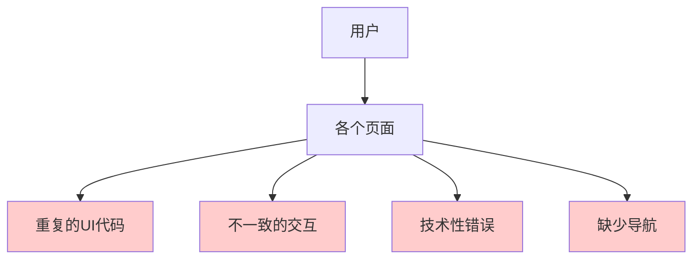

### 优化后
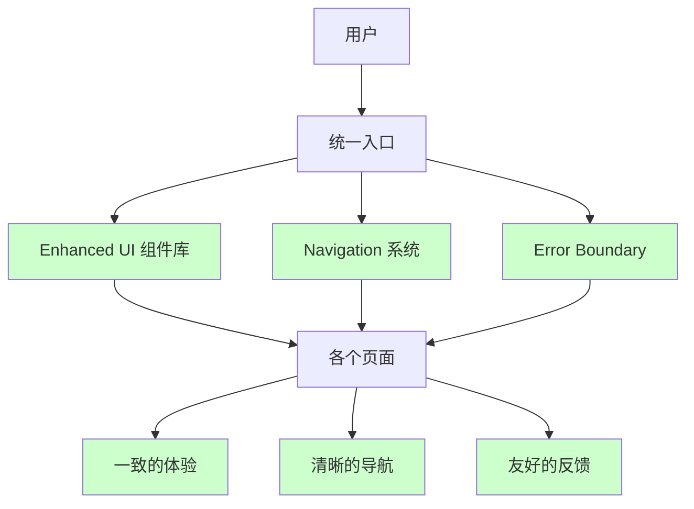

## 用户流程对比

### 优化前：新用户首次使用
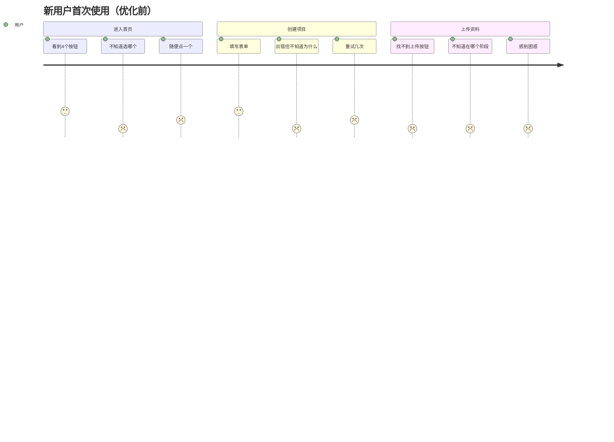

### 优化后：新用户首次使用
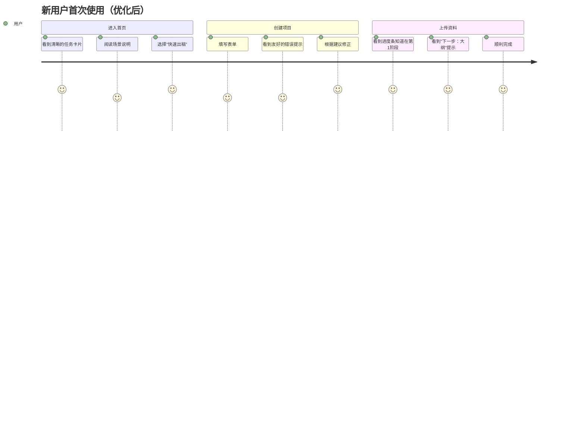

## Generate 页面对比

### 优化前
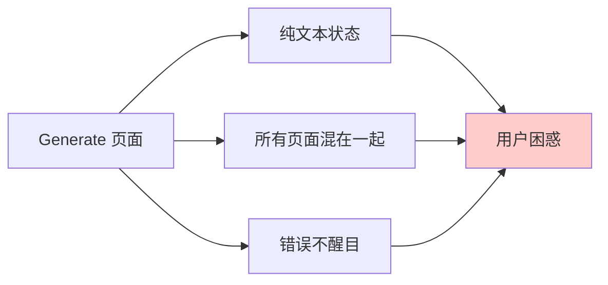

### 优化后
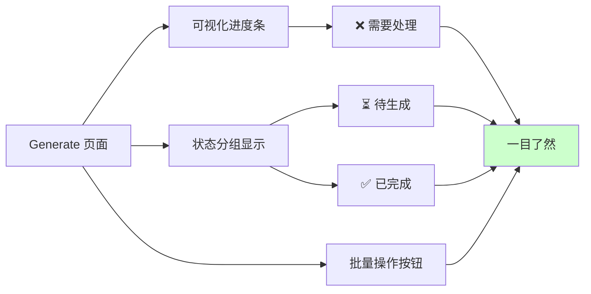

## 组件复用对比

### 优化前：每个页面自己实现
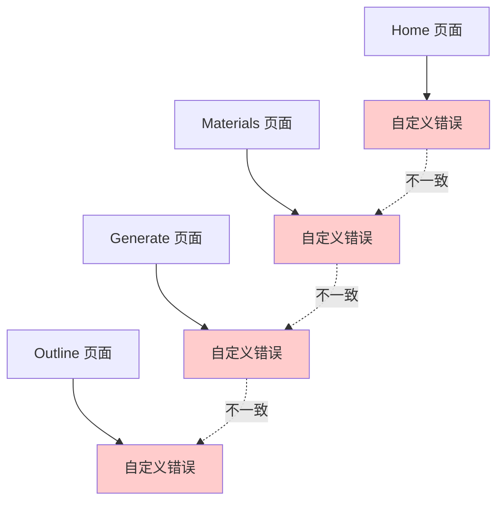

### 优化后：统一组件库
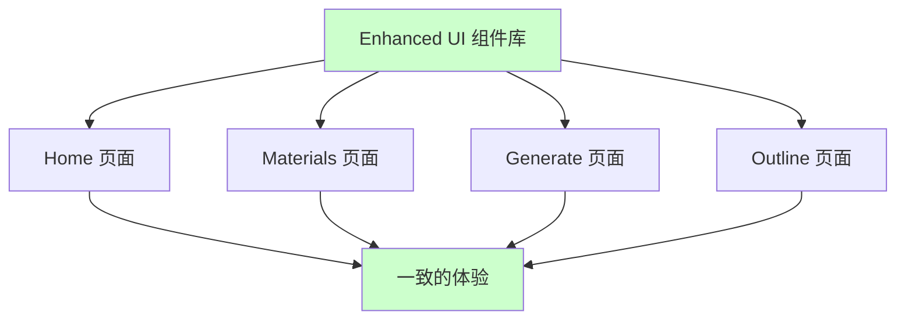

## 错误处理对比

### 优化前
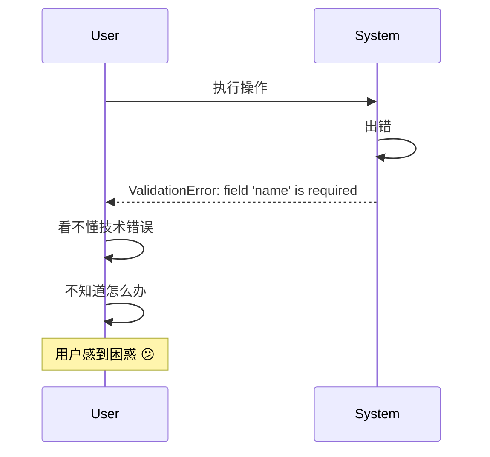

### 优化后
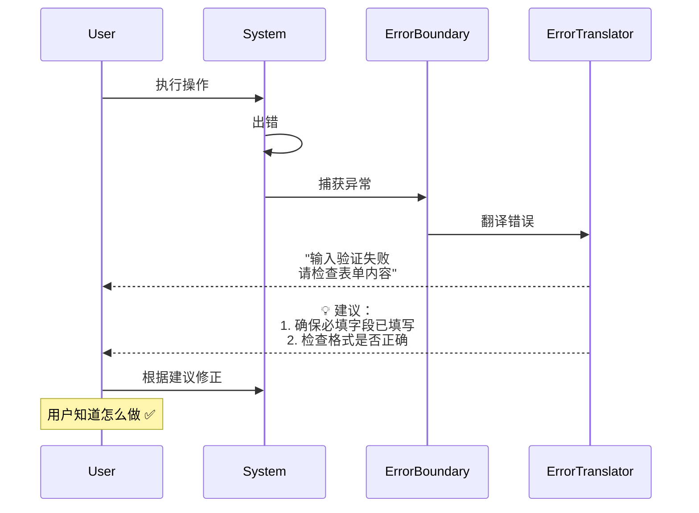

## 导航系统对比

### 优化前：用户迷失
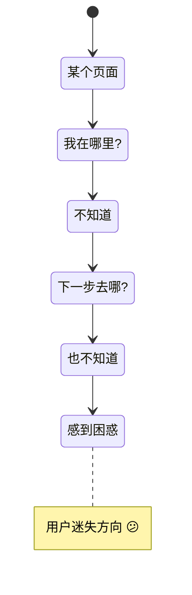

### 优化后：清晰导航
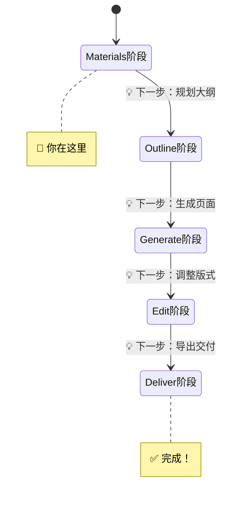

## 信息架构对比

### 优化前：Workspace 页面
```
┌─────────────────────────────────────┐
│ Workspace                           │
├─────────────────────────────────────┤
│ ▼ 资料上传                           │
│ ▼ 文档列表                           │
│ ▼ 事实台账                           │
│ ▼ 素材管理                           │
│ ▼ RAG 预览                          │
│ ▼ 分块检查                           │
│ ▼ 文化叙事                           │
│ ▼ 生成管线                           │
│ ▼ 审核工具                           │
│ ▼ 历史记录                           │
└─────────────────────────────────────┘
❌ 需要大量滚动
❌ 功能混在一起
❌ 不知道优先级
```

### 优化后：Workspace 页面
```
┌─────────────────────────────────────┐
│ Workspace                           │
├─────────────────────────────────────┤
│ [📁 资料与事实] [🔍 诊断工具] [⚙️ 高级功能] │
├─────────────────────────────────────┤
│                                     │
│  📁 资料与事实                       │
│  ────────────────────               │
│  • 上传文档                          │
│  • 管理事实                          │
│  • 组织素材                          │
│                                     │
└─────────────────────────────────────┘
✅ 清晰分组
✅ 功能分离
✅ 优先级明确
```

## 数据流对比

### 优化前
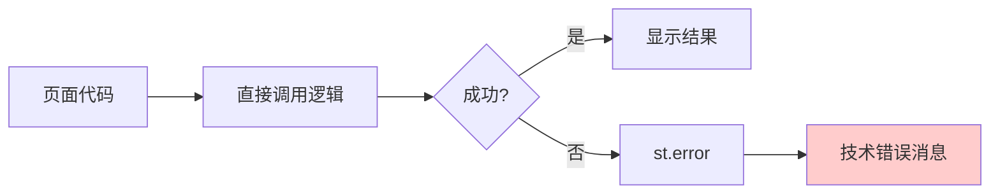

### 优化后
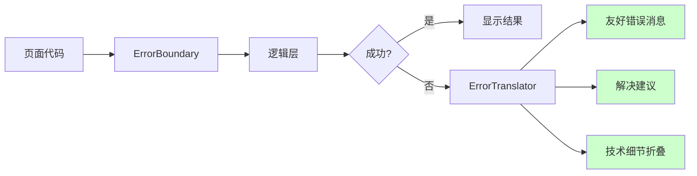

## 开发效率对比

### 优化前：重复劳动
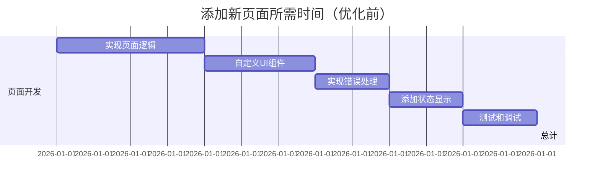

### 优化后：高效开发
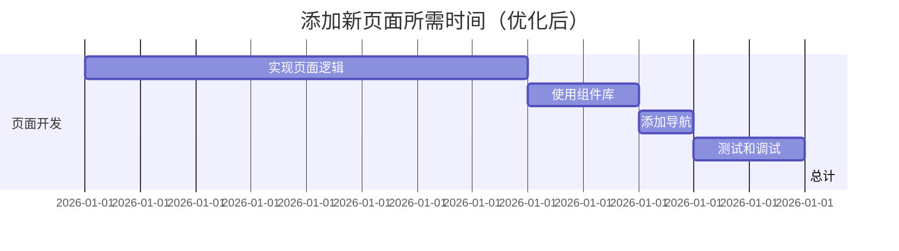

## 维护成本对比

### 问题：需要修改错误消息样式

#### 优化前
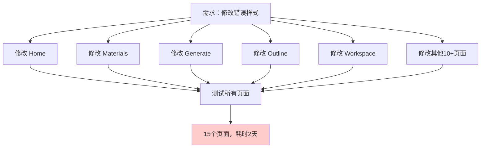

#### 优化后
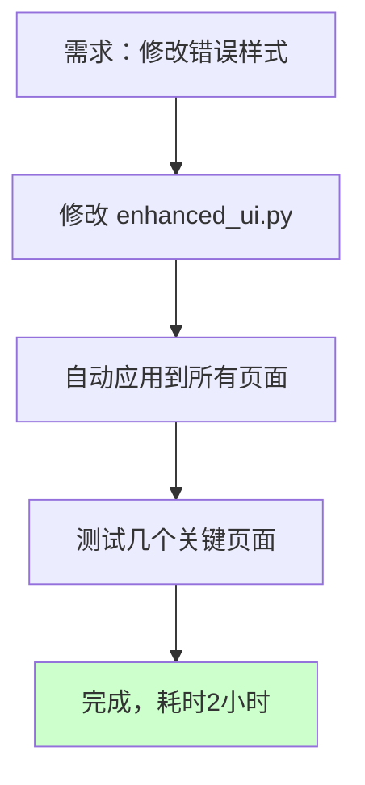

## 总结：关键指标对比

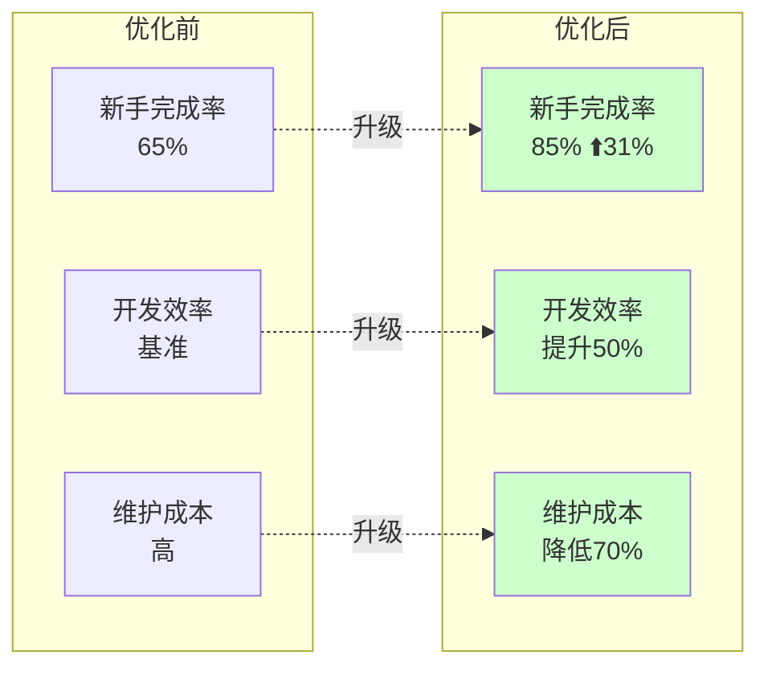

---

**结论**: 通过建立统一的组件库和导航系统，Archium UI 在用户体验、开发效率和维护成本三个维度都获得了显著提升。
